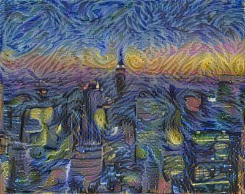
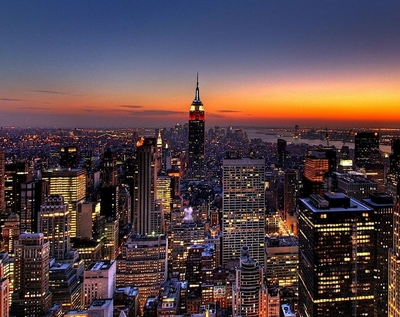
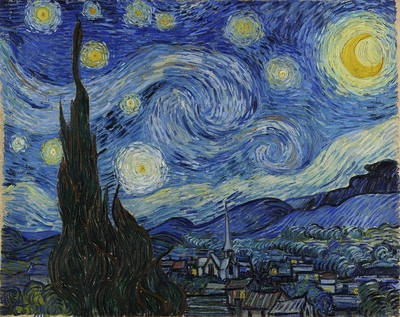

# ArtStyleTransfer
## Overview 
A simple deep convolutional neural network to transfer styles from one image onto another using TensorFlow in Python

My network follows the architecture of the VGG network and uses the weights from imagenet-vgg-verydeep-19.mat.

The style layers, and loss functions follow the implemetation of the network from the paper "Neural Algorithm of Artistic Style" (Gatys,Ecker,Bethge). 

## Example 
An example art style transfer of the NYC skyline.

## How to run
You must have an "images" and an "output" folder.
Images will be read from "images" and then saved in "output" 

`$ python art_generation.py "CONTENT_IMAGE.jpg" "STYLE_IMAGE.jpg" `

### Notes
Images should try to be the same size. 
Best results when images are both the same dimension. 
The images are resized to match before being fed into the network, but some distorsion might occur.
I recommend that unless you want all images to look like they have been styled by Jackson Pollack, its best if you feed the network images that are both the same dimension. 

